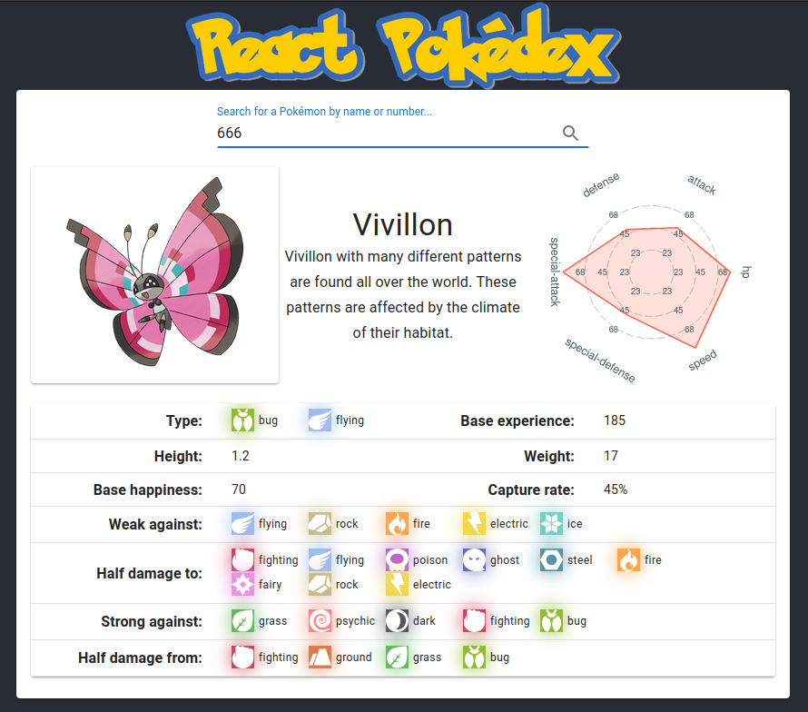

# React Pokédex

A simple Pokédex implementation in React and Typescript:
* Consume Pokémon data from [PokéAPI](https://pokeapi.co/)
* Display information on the user interface using [Material UI](https://mui.com)



# Requirements

Project created using:
* Node 16
* React 18

# How to run

1. Clone de repo:

```shell
git clone https://github.com/felsangom/React-Pokedex
cd React-Pokedex
```

2. Install dependencies:

```shell
npm install
```

3. Start development server:

```shell
npm start
```

It should open the app on your default browser. If not, just open [http://localhost:3000](http://localhost:3000) on your browser.

# Attribution

* Pokémon type icons from [https://github.com/duiker101/pokemon-type-svg-icons](https://github.com/duiker101/pokemon-type-svg-icons)
* Pokémon base stats chart made with [Victory Charts](https://formidable.com/open-source/victory/docs/victory-chart/)

# License

MIT
